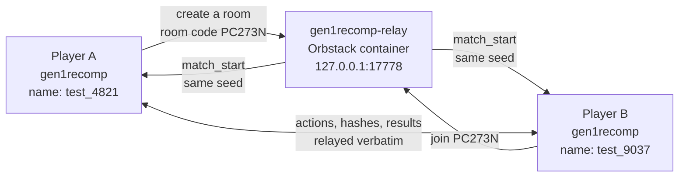

# gen1recomp multiplayer — proof of concept

A self-hosted battle server for gen1recomp, running in an Orbstack container,
so two (or more) players can find each other and battle without going through
the public relay.



---

## ⚠️ Read this first: which Pokémon game?

**This battles in Generation 1 (Red / Blue / Yellow).**

You originally asked about **Gen 3** and the **Union Room**. I have to be
straight with you about both, because it changes what this proof of concept
can be:

* **Gen 3 has no multiplayer code at all.** No networking, no way for two
  copies of the game to agree on a random number, no seam where a turn could
  be handed to a remote player. The Union Room content exists in the game data
  but it is decoration — nothing behind it talks to a server. Making Gen 3
  battle over the internet is a real project, not a proof of concept. I scoped
  it earlier and the first usable milestone came out at **33–58 developer
  days**.
* **Gen 1 and Gen 2 already have a working battle-over-the-network path** in
  the engine (`src/link/LinkBattle.lua` and `src/online/`). That is the path
  this server speaks, so this is the path that can actually be demonstrated
  end to end today.

So: same idea, same shape, earlier generation. If the proof of concept is
convincing, the Gen 3 work is a separate, much larger piece of work — the
scoping document for it is in the session scratch folder, not in this repo.

**There is also no Union Room in Gen 1.** The equivalent is the game's own
**Online panel**, which is in the launcher. That is where you host and join.

---

## What is in here

| Path | What it is |
|---|---|
| `server/server.js` | The battle server. One file, no dependencies. Speaks the game's protocol v2. |
| `Dockerfile` | Packs `server.js` into a tiny container. |
| `docker-compose.yml` | Tells Orbstack to run it. |
| `bin/relay.sh` | Start / stop / watch the container. |
| `bin/play.sh` | Launch the game pointed at the container. |
| `bin/smoke-test.sh` | Runs the repository's own end-to-end test against the server. |

Nothing here touches your existing `loghook` container. `loghook` is a
**write-only log sink** on port 8090 — it receives log lines and stores them.
It has no game logic in it at all, which is why it could not be repurposed and
this is a separate, new container instead.

---

## Quick start

### 1. Start the server

```bash
cd gen1recomp-mp-test
./bin/relay.sh up
```

Expected: a JSON line ending in `"testNames":true`, then a note telling you
which address to point the game at.

### 2. Start the game, pointed at your server

```bash
./bin/play.sh
```

That is it — it sets the address for you. To play a second player **on the
same Mac**, open a second terminal and give that one its own save folder:

```bash
POKEPORT_IDENTITY=player2 ./bin/play.sh
```

To let a **friend on your Wi-Fi** join, they point at your Mac's address
instead of their own:

```bash
./bin/play.sh 192.168.0.134        # use YOUR Mac's IP, see below
```

Find your IP with `ipconfig getifaddr en0`.

### 3. Battle

In the game's **launcher**, open the **Online** panel:

1. One player picks **Host a battle** and walks through the wizard
   (which game → which save → pick your team → rules → visibility).
2. The server shows them a **6-character room code**, like `PC273N`.
3. The other player picks **Join a battle** and enters that code.
4. Both press **Ready**. The battle starts on both machines.

You will appear as `test_4821` and they will appear as `test_9037` — random
names, assigned automatically, no account and no password.

---

## What "working" is measured by

`./bin/smoke-test.sh` runs `tests/drivers/online_relay_smoke.lua`, which is
the repository's own acceptance test for a relay. It starts `server.js`,
connects two real clients, and checks all of this:

- both clients are welcomed as protocol-v2 seats;
- a room is created and joined, and a **Yellow** guest is allowed into a
  **Red** host's room (the games are compatible, so the server must not
  reject them);
- a spectator whose game data does not match is **refused** with
  `profile_mismatch`, and is admitted once it matches;
- a spectator who sends no profile at all is refused with `bad_profile`;
- the server assigns **host** and **guest** by join order;
- both seats are given the **same match token and the same random seed** —
  which is what makes two machines simulate an identical battle;
- a real `LinkBattle` runs over the server's room session, and **both
  simulations agree on the HP** at the end;
- both players report a result and the server announces a **single winner**
  that both seats agree on;
- the room returns to a **waiting** state, ready for a rematch.

If that script exits 0, the server is doing its job.

It needs an imported ROM (a real game must boot before the driver can run), so
it seeds a scratch LÖVE identity called `gen1recomp-mp-smoke` from whichever
identity already has one — `pokemon-love2d` if it exists, otherwise the first
one that does. Your own save folder is never written to.

---

## Operating it

```bash
./bin/relay.sh status     # is it up, and who is connected right now?
./bin/relay.sh logs       # follow the server log
./bin/relay.sh down       # stop it
```

`status` also hits the server's small HTTP control surface:

| Address | Returns |
|---|---|
| `http://127.0.0.1:17779/health` | `{"ok":true,"protocol":2,"players":N,"rooms":N,...}` |
| `http://127.0.0.1:17779/players` | every connected player, their name and their room |
| `http://127.0.0.1:17779/rooms` | every open room, its code, stage and occupants |

The lobby port is published on **17778**, not 7778, so this container can run
alongside the real public relay without a clash.

---

## Settings

Everything is an environment variable. Set them in `docker-compose.yml` and
re-run `./bin/relay.sh up`.

| Variable | Default | What it does |
|---|---|---|
| `PORT` | `7778` | Lobby port inside the container. |
| `HTTP_PORT` | `7779` | Control surface inside the container. |
| `RELAY_TEST_NAMES` | `1` | Rename every arrival to `test_<random>`. Set to `0` to keep the player's own name. |
| `BIND` | `0.0.0.0` | Which interface to listen on. |

On the game side, one variable matters: **`POKEPORT_RELAY_ADDR`**. That is
what `bin/play.sh` sets for you.

---

## What this proof of concept deliberately does not do

These are real gaps, not oversights. They are the difference between "two
friends can battle" and "a public service":

* **No password or account.** Anyone who can reach the port can play. That is
  the point for testing, and it is why you should only run it on your own
  Wi-Fi, not exposed to the internet.
* **No encryption.** Traffic on 17778 is plain text, exactly like the public
  relay. Do not put this on an untrusted network.
* **Results are trusted, not verified.** The server takes each player's word
  for who won; if they disagree it picks deterministically rather than
  crashing or guessing at random. It also trusts the client's team. A
  determined player could cheat. Fixing that means simulating the battle on
  the server, which is a much bigger job.
* **No tournaments.** The server answers tournament requests with "not found"
  on purpose.
* **No persistence.** Rooms, players and reconnect tokens live in memory
  only. Restarting the container empties the lobby.
* **Reconnecting is time-boxed.** If your connection drops mid-battle you
  have two minutes to come back before you are treated as having left.
* **Generation 1 only.** See the warning at the top.

---

## If something goes wrong

| Symptom | Likely cause |
|---|---|
| `bin/play.sh` warns nothing answered on `/health` | The container is not running. `./bin/relay.sh up`. |
| The game says it cannot reach the relay | `POKEPORT_RELAY_ADDR` is wrong, or you launched the game directly instead of through `bin/play.sh`. |
| A friend cannot join | They are using `127.0.0.1` instead of your Mac's IP, or macOS is blocking incoming connections. |
| `Join` is refused as `profile_mismatch` | The two players have different mods or different game data loaded. Match the mods, then retry. |
| `./bin/smoke-test.sh` says a port is busy | A previous run left a server behind; the script clears it automatically, but `lsof -ti tcp:17780 \| xargs kill` will do it by hand. |
| The game never gets past the launcher under the smoke test | It needs an imported ROM. Launch the game normally once and import one, then re-run — the script copies that cache into its scratch identity. |
| The smoke test prints `no imported ROM cache found` | No LÖVE identity on this machine has ever imported a ROM. Run `./bin/play.sh` once and import one. |
